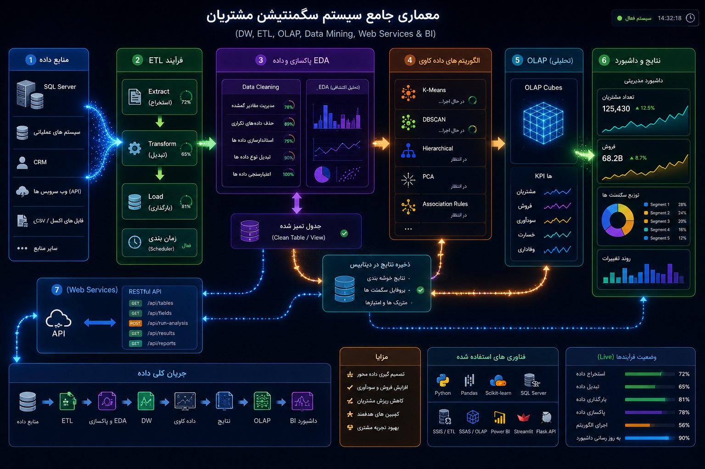

# customer-segmentation-platform
Customer Segmentation Platform is an end-to-end Data Science and Business Intelligence solution designed to analyze customer behavior, identify meaningful customer segments, and support data-driven decision making.  The platform integrates Data Warehouse, ETL, Data Mining, Machine Learning, OLAP, REST APIs, and BI
Overview

Customer Segmentation Platform is an end-to-end Data Science and Business Intelligence solution designed to analyze customer behavior, identify meaningful customer segments, and support data-driven decision making.

The platform integrates Data Warehouse, ETL, Data Mining, Machine Learning, OLAP, REST APIs, and BI Dashboards into a unified architecture.

Business Problem

Organizations often have large amounts of customer data spread across multiple systems but lack a unified view of customer behavior.

This project addresses that challenge by:

Creating a 360° customer view
Identifying customer segments
Supporting targeted marketing campaigns
Improving customer retention
Enhancing risk assessment
Enabling data-driven business decisions
Architecture
Data Sources
     ↓
SQL Server
     ↓
ETL Process
     ↓
Data Cleaning & EDA
     ↓
Clean Data Storage
     ↓
Data Warehouse
     ↓
Customer Segmentation Engine
     ↓
Results Storage
     ↓
OLAP & KPI Layer
     ↓
REST API
     ↓
BI Dashboard
Key Features
Data Discovery
Automatic table detection
Column profiling
Metadata analysis
Data Quality Assessment
Missing value analysis
Duplicate detection
Data validation
Data standardization
Exploratory Data Analysis (EDA)
Distribution analysis
Correlation analysis
Outlier detection
Data quality monitoring
Machine Learning

Currently implemented:

K-Means Clustering

Planned:

DBSCAN
Hierarchical Clustering
PCA
Customer Lifetime Value Modeling
Churn Prediction
Technology Stack
Backend
Python
Flask
Data Processing
Pandas
NumPy
Machine Learning
Scikit-Learn
Database
SQL Server
Analytics
Data Warehouse
ETL
OLAP
Frontend
Streamlit
Visualization
Power BI
Workflow
Step 1: Data Extraction

Customer data is extracted from SQL Server.

Step 2: Data Profiling

The system evaluates:

Missing values
Data types
Unique values
Data quality indicators
Step 3: Data Cleaning
Missing value handling
Duplicate removal
Data normalization
Label encoding
Step 4: EDA

Data distributions and quality metrics are analyzed.

Step 5: Segmentation

K-Means clustering groups customers into meaningful segments.

Step 6: Results Storage

Segmentation results are stored back into the database.

Step 7: BI Reporting

Results are exposed through APIs and visualized in dashboards.

Insurance Use Cases
Customer Segmentation
Risk-Based Customer Analysis
Cross-Sell Opportunities
Customer Retention Analysis
Renewal Prediction
Fraud Detection (Future Phase)
Business Value
Reduced Loss Ratio
Improved Customer Retention
Increased Cross-Selling
Better Marketing Efficiency
Improved Risk Assessment
Enhanced Customer Experience
Future Roadmap
Churn Prediction
Fraud Detection
Recommendation Engine
Customer Lifetime Value (CLV)
Generative AI Insights
Real-Time Analytics
Author

Sara Sohrabi

Data Science | Machine Learning | Insurance Analytics | BI & Data Warehouse

## Architecture

